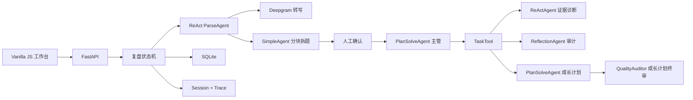

# Offer Radar Agent

Offer Radar Agent 是一个本地优先的智能面试复盘助手。它在保留原有 Offer Radar 工作台体验的基础上，把固定 LLM 流程升级为可暂停、可恢复、有证据链和审计记录的多 Agent 工作流。

本仓库是个人独立设计与迭代的作品仓库，与 HelloAgents 社区毕业设计提交目录相互独立。当前版本聚焦产品 MVP 和工程实现，暂不包含毕业设计评测、数据集指标或消融实验。

当前稳定版本：`v0.4.1`。

## 核心能力

- TXT、PDF、DOCX 材料解析，单文件限制 5MB；扫描 PDF 暂不做 OCR。
- MP3、M4A、WAV、FLAC、OGG 音频通过 Deepgram `nova-3` 转写，限制 200MB、120 分钟。
- ReAct ParseAgent 调用材料检查、转写、校验、语义拆题和提交工具；SimpleAgent Worker 分块识别主问题、回答与追问。
- 原始转写和人工修订双轨保存，题卡只能引用真实片段；生成后停在人工确认节点。
- PlanSolveAgent 主管按照“证据诊断、逐题质量审计、成长计划、成长计划终审”四阶段调度。
- ReActAgent、ReflectionAgent、PlanSolveAgent 子 Agent 通过 TaskTool 协作。
- 原回答、JD、简历和本地知识库引用均带来源定位；无效引用在审计阶段移除。
- 五维评分由代码按 `20/15/25/20/20` 权重计算，模型不能直接修改总分。
- 每个主题、审计轮次和成长计划都保存版本化 artifact；失败后从最近已接受检查点恢复。
- QualityAuditor 在报告发布前终审成长计划；首轮发现问题时最多退回 GrowthPlanner 修订一次，第二轮关键问题会阻止发布。
- SSE 展示阶段、工具、证据数、耗时和错误，不输出模型隐藏思考。
- SQLite 保存业务记录，HelloAgents SessionStore 和 TraceLogger 保存恢复与审计信息。
- fixture 模式无需 API Key，适合本地演示；HelloAgents 模式调用真实模型且不会静默降级。

## 架构



## 本地启动

项目已经使用 Python 虚拟环境 `.venv`。在 PowerShell 中运行：

```powershell
cd "D:\Class\project\PM\vibe coding"
.\start.ps1
```

然后访问 [http://127.0.0.1:8000](http://127.0.0.1:8000)。默认 `fixture` 模式不访问外部模型，可使用 [示例面试稿](data/samples/demo_transcript.txt) 体验完整流程。

若需要重新安装依赖：

```powershell
python -m venv .venv
.\.venv\Scripts\python.exe -m pip install -r requirements-dev.txt
```

## 真实模型模式

复制 `.env.example` 为 `.env`，只在服务端填写：

```dotenv
AGENT_RUNTIME=helloagents
LLM_MODEL_ID=gpt-4.1-mini
LLM_API_KEY=your-key
LLM_BASE_URL=https://api.openai.com/v1
ASR_PROVIDER=deepgram
DEEPGRAM_MODEL=nova-3
DEEPGRAM_API_KEY=your-deepgram-key
```

API Key 不会发送到浏览器，也不会写入 SQLite。默认 `AGENT_RUNTIME=fixture`；显式选择 `helloagents` 但缺少 LLM Key 时，创建复盘会返回配置错误，不会伪装成真实 Agent 或自动生成规则报告。未配置 Deepgram Key 时文字解析仍可用，音频入口会禁用。

真实 Agent 任务失败后，用户可以调用 `/api/v1/runs/{id}/resume` 从检查点恢复，或明确调用 `/api/v1/runs/{id}/fallback` 生成确定性降级报告。前端只展示 `实时 Agent`、`演示模式` 或 `确定性降级`，不显示底层框架类名。

## Docker

```powershell
docker compose up --build
```

Docker 默认仍使用 fixture 模式，数据保存在命名卷 `offer-radar-data` 中。

## 主要目录

```text
backend/app/agents/     HelloAgents 主管与子 Agent 适配
backend/app/services/   文档解析、知识检索、证据复盘、工作流
backend/app/tools/      结构化自定义工具
frontend/               原生 JS 工作台
knowledge/              STAR/PREP、题型和五维评分知识包
data/samples/           本地演示材料
tests/                  基础功能和 API 回归测试
```

## 状态与接口

状态机：`DRAFT -> PARSING -> WAITING_CONFIRMATION -> REVIEWING -> AUDITING -> COMPLETED`，失败和取消分别进入 `FAILED`、`CANCELLED`。

解析子状态：`QUEUED -> INSPECTING -> TRANSCRIBING -> VALIDATING -> STRUCTURING -> SUBMITTING -> COMPLETED`，文字来源自动跳过 `TRANSCRIBING`。

核心接口包括 `/api/v1/interviews`、`/materials`、`/parse`、`/parse-runs/{id}/events`、`/segments`、`/questions`、`/confirm`、`/review-runs`、`/runs/{id}/events`、`/resume`、`/fallback`、`/report` 和 `/api/v1/profile/trends`。成长行动进度通过 `GET /api/v1/growth-plans/{runId}` 读取，并通过 `PATCH /api/v1/growth-actions/{actionId}` 保存状态、备注、完成证据和自评；更新请求需携带 `runId`。旧版四个 Node API 路径由 FastAPI 兼容层暂时承接。

## 隐私边界

- 上传材料只写入本项目 `data` 目录；音频仅在用户明确确认授权后发送到 Deepgram。
- 删除面试会同时删除本机音频、片段、解析 artifact、题卡和报告。
- Trace 会脱敏，不记录 API Key；公开 SSE 不包含原始提示词和隐藏思考。
- 联网核验默认关闭，启用后也只能补充事实引用，不能单独提高面试评分。
- 第一版不包含 OCR、实时录音、本地语音模型、账号、云同步、向量数据库和自动投递。

## 基础验证

```powershell
.\.venv\Scripts\python.exe -m pytest -q
node --check frontend\app.js
node --check frontend\data-model.js
```

启动本地服务后，可使用系统 Edge 运行完整桌面/移动端路径：

```powershell
.\.venv\Scripts\python.exe tests\ui_smoke.py http://127.0.0.1:8000 data
```

这些命令只验证本地功能，不包含毕业设计评测、数据集指标或消融实验。分支、提交与版本标签约定见 [版本管理说明](docs/version-control.md)。
