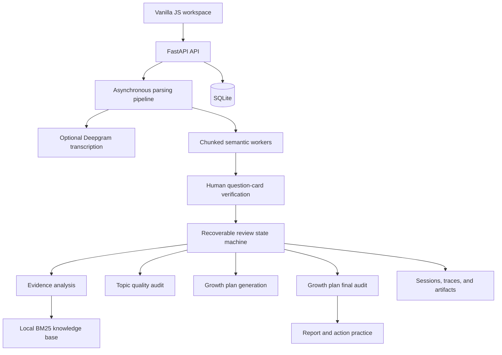

# Interview Review Assistant

> A local-first, evidence-driven interview review workspace that turns raw transcripts into verified question cards, structured feedback, and actionable practice.

[](https://www.python.org/)
[](https://fastapi.tiangolo.com/)
[](https://www.sqlite.org/)
[](https://github.com/HAPPYY2003/interview-review-assistant/actions/workflows/ci.yml)
[](#quality-and-testing)

Interview Review Assistant is both a working AI product and my product management portfolio project. It does more than send an interview transcript to a language model for a one-shot summary. The product is designed around four harder questions:

- Can every important conclusion be traced back to the original material?
- Can the user correct parsing mistakes before they affect the report?
- Can feedback be converted into a concrete practice loop?
- Can a long-running AI workflow recover when a model or service fails?

I led the product definition, interaction design, agent workflow design, implementation, testing, and release iteration. The repository includes a deterministic demo mode, synthetic sample data, and an optional real-model mode.

> **Language note:** Repository documentation is in English. The current product UI and synthetic interview corpus are Chinese-first because the initial target users are Chinese-speaking job seekers.


## Try It in 3 Minutes

The default `fixture` mode does not call a language model or upload private material. It is the fastest way to explore the complete product flow.

### Option A: Docker

Prerequisite: [Docker Desktop](https://www.docker.com/products/docker-desktop/)

```bash
git clone https://github.com/HAPPYY2003/interview-review-assistant.git
cd interview-review-assistant
docker compose up --build
```

Open [http://127.0.0.1:8000](http://127.0.0.1:8000). The Docker setup uses fixture mode by default and stores application data in a named local volume.

### Option B: Python

Prerequisite: Python 3.11

Windows PowerShell:

```powershell
git clone https://github.com/HAPPYY2003/interview-review-assistant.git
cd interview-review-assistant
py -3.11 -m venv .venv
.\.venv\Scripts\python.exe -m pip install -r requirements.txt
Copy-Item .env.example .env
.\start.ps1
```

macOS or Linux:

```bash
git clone https://github.com/HAPPYY2003/interview-review-assistant.git
cd interview-review-assistant
python3.11 -m venv .venv
source .venv/bin/activate
python -m pip install -r requirements.txt
cp .env.example .env
python -m uvicorn backend.app.main:app --host 127.0.0.1 --port 8000 --reload
```

Then open [http://127.0.0.1:8000](http://127.0.0.1:8000).

### First Product Walkthrough

1. Open **New Review** in the left navigation.
2. Use the demo-data action or upload synthetic material from `data/samples/`.
3. Start parsing and review the generated main questions and follow-ups.
4. Confirm the question cards to launch the four-stage review workflow.
5. Open the report, inspect evidence references, and start an action practice session.

No API key is required for this walkthrough.

## Product Snapshot

| Area | Description |
| --- | --- |
| Target users | Job seekers who have an interview transcript or recording and want a rigorous review and practice loop |
| Core problem | Generic AI summaries are difficult to verify, easy to hallucinate, and rarely translate into action |
| Product position | A local-first, evidence-driven, human-controlled interview review assistant |
| My role | Product manager, product designer, and independent developer |
| Current stage | Working MVP with deterministic demo mode and optional real-model execution |
| Stack | FastAPI, SQLite, Vanilla JavaScript, an agent runtime, Deepgram, and local BM25 retrieval |

## Product Case Study

### The Challenge

After an interview, candidates usually remember fragments: one weak answer, an uncomfortable follow-up, or a vague sense that something went wrong. A generic AI summary can be fast, but it introduces new product risks:

- Questions, answers, and follow-ups may be grouped incorrectly.
- Scores and recommendations may not be supported by the transcript.
- The model may rewrite the candidate's experience instead of preserving the source.
- Advice often remains a reading artifact rather than becoming a training task.
- Timeouts or invalid structured output can force the user to restart an expensive workflow.
- Resumes, recordings, and interview transcripts create a sensitive privacy boundary.

### The Product Thesis

```text
Let AI interpret meaning, let deterministic code enforce evidence and rules,
and let the user retain final control over uncertain decisions.
```

This thesis shaped the workflow, data model, interface, failure states, and release priorities.

### Key Product Decisions

| Decision | User problem addressed | Product implementation |
| --- | --- | --- |
| Parse before reviewing | A wrong question-answer structure contaminates every later conclusion | Main questions and follow-ups are grouped into topics, then paused for human confirmation |
| Preserve source and edits separately | Users need to fix transcription errors without destroying provenance | Raw segments remain immutable; edits are stored separately; references still point to the source |
| Make evidence a first-class object | Plausible feedback is not necessarily trustworthy feedback | Evidence IDs are registered by local tools and must resolve to a character range or timestamp |
| Calculate scores in code | A model should not freely invent or adjust aggregate scores | The model submits evidence-supported dimension levels; fixed weights produce the final score |
| Audit both review and plan | A good diagnosis can still produce a weak or unsupported action plan | Topic reviews are audited before planning, and the growth plan receives a final audit before release |
| Connect the report to practice | Reading recommendations does not create behavioral change | Every action can open an oral, follow-up, case-building, or knowledge practice session |
| Default to local storage | Interview materials contain sensitive personal and company information | SQLite stores product data locally; cloud transcription requires explicit consent |

### End-to-End User Journey


## Core Experience

### 1. Multi-Source Input

- Paste text or upload TXT, PDF, DOCX, MP3, M4A, WAV, FLAC, or OGG files.
- PDF and DOCX files are limited to 5 MB; scanned-document OCR is outside the current scope.
- Audio files are limited to 200 MB and 120 minutes.
- Optional Deepgram `nova-3` transcription preserves timestamps, speaker labels, and confidence.

### 2. Semantic Parsing with Human Verification

- The system creates immutable source segments and removes timeline markers, subtitle counters, and obvious noise.
- It identifies interviewer turns, candidate turns, main questions, answers, and follow-up relationships.
- A topic type is determined by the main question; each follow-up stores a separate probe focus.
- Uncertain boundaries, speaker roles, parent relationships, or source references are routed to focused review.
- Users can edit content and speaker roles, merge topics, split follow-ups, or exclude noise before analysis.

### 3. Recoverable Four-Stage Review

```text
Evidence review -> Topic quality audit -> Growth plan -> Growth plan final audit
```

- **Evidence review:** analyzes the answer, follow-ups, resume, job description, and local knowledge base.
- **Topic quality audit:** checks unsupported judgments, invalid references, score conflicts, missed follow-ups, and unsuitable answer frameworks.
- **Growth plan:** converts repeated capability gaps into next actions instead of a generic daily checklist.
- **Growth plan final audit:** checks coverage, executability, verifiable completion criteria, invented claims, and prohibited hiring-probability language.

Each stage saves a versioned artifact and checkpoint. A failed or timed-out run can resume from the latest completed stage instead of restarting the interview.

### 4. Evidence-Driven Report

The report contains:

- Overall interview evaluation and five-dimension scoring.
- Skill and knowledge gaps linked to source questions.
- Next actions with verifiable completion criteria.
- Topic-level views for answer logic, interviewer signals, diagnosis, improved answer, and evidence.
- Separate topic-review and growth-plan audit summaries.
- Markdown export and cross-interview trend views.

The fixed scoring model is:

| Dimension | Weight |
| --- | ---: |
| Relevance | 20% |
| Structure | 15% |
| Evidence | 25% |
| Analytical depth | 20% |
| Role fit | 20% |

### 5. Action Practice

Every next action supports four practice modes:

| Mode | Intended use |
| --- | --- |
| Oral answer | Practice explaining an experience clearly within a time limit |
| Follow-up drill | Prepare for deeper questions about contribution, data, and decisions |
| Case builder | Complete missing context, process, metrics, and failure material |
| Knowledge quiz | Check role-specific concepts, methods, and tools |

Practice briefs are generated only when requested, so they do not increase formal review time. Drafts, attempts, and structured feedback remain local. New claims or numbers introduced during practice are marked for verification and never become report evidence automatically.


## Information Architecture

The current workspace has three primary areas:

- **Interview Records:** inspect status, continue verification, resume a failed workflow, or open a completed report.
- **New Review:** add role context, resume, job description, transcript, or audio and start parsing.
- **Growth Trends:** compare overall scores, dimension changes, and repeated gaps across interviews.

The report explains the problem and proposes actions. The practice drawer completes one focused training task. This separation keeps the report scannable while leaving room for a future cross-interview practice center.

## System Architecture



### AI and Deterministic-Code Responsibilities

| Stage | AI responsibility | Deterministic responsibility |
| --- | --- | --- |
| Parsing | Semantic roles, question-answer grouping, follow-up relationships, and probe focus | Timeline cleanup, character offsets, schemas, provenance, and conflict validation |
| Evidence review | Diagnose logic, select an answer framework, and interpret observable interviewer signals | Provide a restricted evidence packet, validate evidence IDs and numbers, and aggregate scores |
| Quality audit | Find unsupported claims, omissions, and contradictions | Limit rounds, lock a valid submission, and version artifacts |
| Growth plan | Generate capability gaps, actions, and completion criteria | Validate topic/evidence/gap relationships and ensure high-priority gap coverage |
| Practice | Generate a personalized brief and structured feedback | Save drafts and attempts, flag factual risks, and control status and timeouts |

## Run with a Real Model

Fixture mode is recommended for product evaluation and demos. To use real model execution, update the server-side `.env` file:

```dotenv
AGENT_RUNTIME=helloagents
LLM_MODEL_ID=gpt-4.1-mini
LLM_API_KEY=your-key
LLM_BASE_URL=https://api.openai.com/v1

ASR_PROVIDER=deepgram
DEEPGRAM_MODEL=nova-3
DEEPGRAM_API_KEY=your-deepgram-key

WEB_VERIFY_ENABLED=false
TAVILY_API_KEY=
```

- Without an LLM key, real mode returns an explicit configuration error; it does not disguise deterministic output as model output.
- Without a Deepgram key, text parsing still works and audio transcription is unavailable.
- Web verification is disabled by default. When enabled, web results can supplement factual references but cannot raise an interview score by themselves.

## Data and Privacy

- `.env`, SQLite databases, uploads, audio, sessions, traces, and logs are excluded from Git.
- Transcripts, question cards, reports, and practice history are stored in local SQLite by default.
- Audio is sent to Deepgram only after the user confirms consent and de-identification.
- Deleting an interview cascades to its materials, question cards, reports, growth actions, and practice history.
- SSE and trace logs exclude API keys, full private materials, and hidden model reasoning.
- All companies, roles, resumes, metrics, and interview answers in repository samples are synthetic.

For friends or evaluators, use fixture mode and synthetic data. Do not upload private interview material to a shared or untrusted machine.

## Quality and Testing

The project contains more than 100 automated tests covering:

- Document and audio inspection, timeline cleanup, speaker inference, and topic organization.
- Character/timestamp provenance, evidence validation, numeric constraints, and scoring.
- Structured AI submissions, timeouts, retries, checkpoints, and artifact versions.
- Growth-plan audits, action practice, draft recovery, and cascading deletion.
- Complete desktop and mobile user journeys through Playwright.

Install development dependencies and run:

```powershell
.\.venv\Scripts\python.exe -m pip install -r requirements-dev.txt
.\.venv\Scripts\python.exe -m pytest -q
node --check frontend\app.js
node --check frontend\data-model.js
```

With the fixture server running, execute the UI regression suite:

```powershell
.\.venv\Scripts\python.exe tests\ui_smoke.py http://127.0.0.1:8000 data
```

Automated tests do not call a real model or upload private material.

## API Overview

| Capability | Endpoint |
| --- | --- |
| Create and manage interviews | `POST/GET /api/v1/interviews` |
| Add material and start parsing | `POST /api/v1/interviews/{id}/materials`, `POST /parse` |
| Parse status and events | `GET /api/v1/parse-runs/{id}`, `GET /events` |
| Human editing and confirmation | `PATCH /segments`, `PATCH /questions`, `POST /confirm` |
| Start and resume review | `POST /review-runs`, `POST /api/v1/runs/{id}/resume` |
| Read a report | `GET /api/v1/interviews/{id}/report` |
| Growth actions | `GET /api/v1/growth-plans/{runId}`, `PATCH /growth-actions/{id}` |
| Practice | `POST /growth-actions/{id}/practice-sessions`, `POST /practice-sessions/{id}/submit` |
| Growth trends | `GET /api/v1/profile/trends` |

Interactive API documentation is available at `/docs` while the service is running.

## Repository Structure

```text
backend/app/agents/     AI runtime and role adapters
backend/app/services/   Parsing, evidence, review, practice, and state machines
backend/app/tools/      Controlled tools with Pydantic schemas
frontend/               Vanilla JavaScript product workspace
knowledge/              Answer frameworks, question types, and scoring guidance
data/samples/           Synthetic demonstration material
tests/                  Unit, API, workflow, and UI regression tests
docs/                   Versioning guidance and portfolio assets
```

## Product Validation and Metrics

The current repository demonstrates engineering and workflow validation rather than claiming production adoption. Existing evidence includes a runnable end-to-end MVP, deterministic fixture flows, synthetic cross-role cases, and automated regression coverage.

The next product validation phase should track:

- **Activation:** percentage of users who create a review and reach question-card confirmation.
- **Time to first report:** median time from material submission to report release.
- **Verification burden:** percentage of topics that require manual correction.
- **Recovery success:** percentage of failed runs completed through checkpoint recovery.
- **Practice conversion:** percentage of recommended actions that start a practice session.
- **Repeat value:** percentage of users who return for a second interview review or practice attempt.

Any future analytics should be opt-in, documented, and separated from private transcript content.

## Roadmap

### Delivered

- Text, document, and prerecorded-audio input.
- Semantic parsing, main-question/follow-up grouping, and human verification.
- Evidence-driven scoring, topic-level review, and two-stage quality auditing.
- Growth trends, next actions, and report-level practice sessions.
- Timeout handling, deterministic fallback, and checkpoint recovery.

### Next

- A cross-interview practice center for drafts, feedback, and attempt history.
- Practice progress in capability trends while keeping it separate from interview scores.
- Spoken-answer practice with pacing and delivery feedback.
- Supervisor-level risk classification and dynamic tool permissions by topic.
- Optional cloud deployment with accounts, tenant isolation, usage limits, deletion controls, and opt-in analytics.

### Intentionally Out of Scope

- OCR for scanned PDFs, live interview recording, and local speech models.
- Multi-user collaboration and automatic job application.
- Vector databases and hiring-probability predictions.

## What This Portfolio Demonstrates

1. **End-to-end product thinking:** expanding a report generator into an input, verification, diagnosis, audit, action, practice, and feedback loop.
2. **Responsible AI boundaries:** assigning semantic judgment to models while keeping evidence, permissions, scoring, and writes under deterministic control.
3. **Failure experience design:** turning timeouts, invalid structures, and unavailable services into understandable, recoverable product states.
4. **Complex information architecture:** making scores, gaps, actions, topic reviews, and evidence scannable without hiding provenance.
5. **Verifiable delivery:** combining synthetic cases, fixture mode, and automated tests so the project can be demonstrated reliably rather than only described as a prototype.

See [CHANGELOG.md](CHANGELOG.md) for release history and [docs/version-control.md](docs/version-control.md) for repository conventions.
