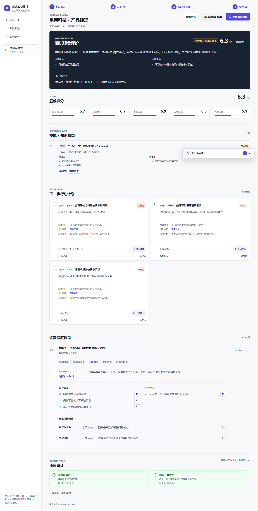
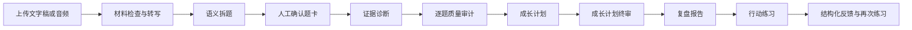
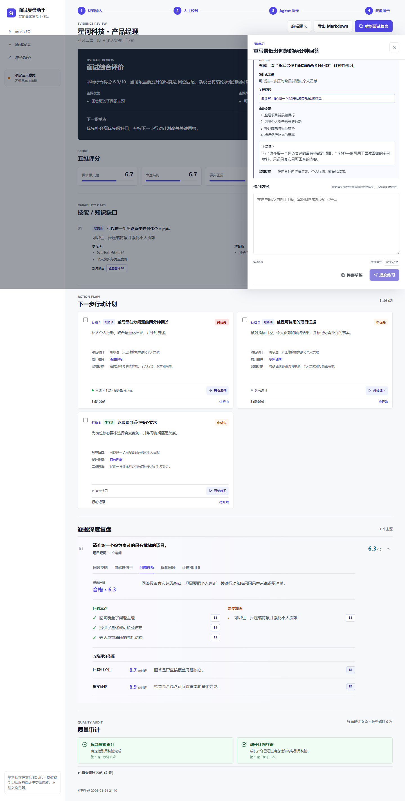
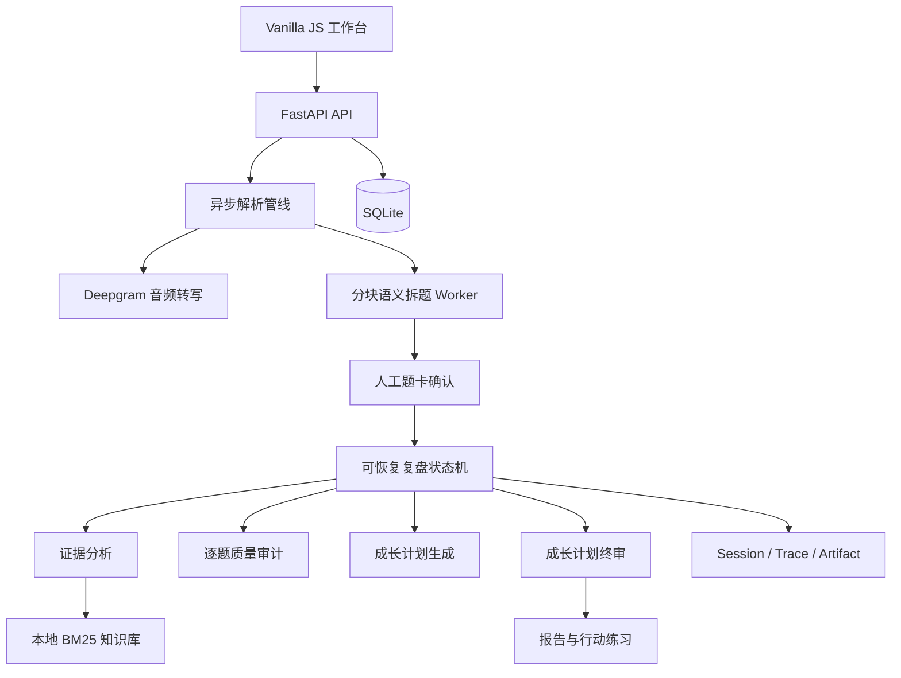

# 面试复盘助手

> 将杂乱的面试转写稿，转化为可回查证据、可人工校对、可持续练习的面试复盘闭环。

[](https://www.python.org/)
[](https://fastapi.tiangolo.com/)
[](https://www.sqlite.org/)
[](#测试与质量保障)

这是一个面向求职者的智能面试复盘产品，也是我的个人产品经理作品。项目不是把面试稿简单交给大模型总结，而是围绕“原文是否可信、结论能否回查、建议能否执行、失败能否恢复”设计了一套完整工作流。

我在这个项目中负责产品定义、交互设计、Agent 工作流设计、前后端实现、测试与版本迭代。当前仓库提供可直接运行的 MVP、合成演示案例、确定性演示模式和真实模型模式。

## 项目概览

| 项目维度 | 内容 |
| --- | --- |
| 目标用户 | 拿到面试文字稿或录音、希望系统复盘并持续训练的求职者 |
| 核心问题 | 普通 AI 总结缺少证据、容易改写原话、输出难以执行、失败后需要重跑 |
| 产品定位 | 本地优先、证据驱动、人工可控的智能面试复盘助手 |
| 我的角色 | 产品经理 / 独立设计与开发 |
| 当前阶段 | 可运行 MVP，支持完整演示与真实模型调用 |
| 技术实现 | FastAPI、SQLite、Vanilla JS、HelloAgents、Deepgram、本地 BM25 检索 |



## 为什么做这个产品

一次面试结束后，求职者通常只记得零散感受：哪道题没答好、面试官似乎不满意、回去应该再准备什么。直接让大模型总结虽然很快，但常见问题也很明显：

- **原话被改写**：问题、回答和追问混在一起，难以确认模型是否理解正确。
- **判断缺少证据**：分数和结论看起来完整，却无法定位到面试原文、简历或岗位 JD。
- **建议停留在阅读**：报告给出很多建议，但用户不知道下一步具体练什么、怎么判断完成。
- **长任务不稳定**：模型超时、结构化提交失败后只能重新运行，时间和成本都被浪费。
- **隐私边界模糊**：面试稿、简历和录音包含个人信息，用户不知道哪些内容会离开本机。

因此，我把产品目标定义为：

```text
让 AI 负责理解和分析，让代码保证引用和规则，让用户掌握最终确认权。
```

## 核心产品决策

| 产品决策 | 解决的问题 | 实现方式 |
| --- | --- | --- |
| 先拆题、后复盘 | 避免模型基于错误问答关系继续分析 | 主问题与追问按主题聚合，生成后暂停等待人工确认 |
| 原文与修订双轨保存 | 允许修正转写错误，又不破坏证据来源 | 原始片段只读，人工修改单独保存；评分使用修订版，引用仍回到原文 |
| 证据优先 | 防止无依据结论和数字幻觉 | 证据 ID 由本地工具注册，所有引用必须通过字符或时间位置回查 |
| 分数由代码计算 | 避免模型任意调整总分 | 模型只提交有证据支持的维度等级，代码按固定权重聚合 |
| 两级质量审计 | 让逐题诊断和成长计划都经过检查 | 逐题复盘审计后再生成计划，成长计划发布前执行终审与一次定向修订 |
| 报告连接练习 | 把“知道问题”转化为“完成训练” | 每项行动可进入口述、追问、案例或知识练习，并保存草稿与多次反馈 |
| 本地优先与显式授权 | 降低隐私风险 | SQLite 本机存储；音频发送到转写服务前必须明确确认 |

## 用户体验流程



### 1. 多来源材料输入

- 支持粘贴文字、上传 TXT/PDF/DOCX 和上传预录音频。
- PDF、DOCX 单文件限制 5 MB；首版不处理扫描件 OCR。
- 音频支持 MP3、M4A、WAV、FLAC、OGG，限制 200 MB、120 分钟。
- 音频通过 Deepgram `nova-3` 转写，并保留时间戳、说话人和置信度。

### 2. 语义拆题与人工确认

- 将转写稿切分为不可变原文片段，过滤时间轴、字幕编号和明显噪声。
- 识别面试官、候选人、主问题、回答和追问关系。
- 主题题型由主问题决定；追问使用独立的“考察重点”，避免技术、业务和行为追问造成题型冲突。
- 低置信度边界、说话人、父题归属或原文引用会进入重点校对。
- 用户可以修改题目、答案和说话人，合并主题、拆出追问或排除噪声。

### 3. 四阶段智能复盘

```text
证据诊断 -> 逐题质量审计 -> 成长计划 -> 成长计划终审
```

- **证据诊断**：结合原回答、追问、简历、岗位 JD 与本地知识库分析每个主题。
- **逐题质量审计**：检查无效引用、无证据判断、分数冲突、遗漏追问和不适配框架。
- **成长计划**：从能力缺口生成下一步行动，而不是泛化的“七天打卡”。
- **成长计划终审**：检查行动是否覆盖缺口、是否可执行、完成标准是否可验证、是否出现虚构经历或录用概率。

长任务通过阶段 artifact 与检查点保存。超时或结构化提交失败后，可以从最近已完成阶段恢复，不必重跑整场面试。

### 4. 证据驱动的复盘报告

报告包含：

- 面试综合评价与五维评分。
- 技能 / 知识缺口及其对应题目。
- 下一步行动计划和可验证完成标准。
- 逐题深度复盘：回答逻辑、面试官信号、问题诊断、优化回答、证据引用。
- 逐题审计与成长计划终审记录。
- Markdown 导出和历次面试成长趋势。

五维评分固定为：

| 维度 | 权重 |
| --- | ---: |
| 回答相关性 | 20% |
| 表达结构 | 15% |
| 事实证据 | 25% |
| 分析深度 | 20% |
| 岗位匹配 | 20% |

### 5. 报告内行动练习

每项下一步行动都可以进入四种练习模式：

| 模式 | 适用场景 |
| --- | --- |
| 口述表达 | 练习在限定时间内完整讲清一段经历 |
| 追问演练 | 针对面试官可能继续核查的贡献、数据和决策进行补答 |
| 案例补充 | 梳理缺失的背景、过程、指标和失败材料 |
| 知识自测 | 检查岗位相关概念、方法与工具掌握情况 |

练习内容按点击生成，不增加正式复盘耗时。草稿、每次提交和结构化反馈保存在本机；练习中新增加的事实或数字会标记为“待核实”，不会写回正式报告证据。



## 信息架构

当前工作台包含三个一级入口：

- **面试记录**：查看复盘状态，继续题卡确认、恢复失败任务或打开报告。
- **新建复盘**：录入岗位、简历、JD 与面试材料并启动解析。
- **成长趋势**：对比多场面试的总分、五维变化与重复薄弱项。

报告页继续承担“解释问题与提出行动”；练习抽屉承担“完成一次具体训练”。这种分工避免把报告页变成复杂的训练中心，也为后续跨面试练习中心保留扩展空间。

## 系统架构



### Agent 与本地规则的分工

| 环节 | Agent 负责 | 本地代码负责 |
| --- | --- | --- |
| 拆题 | 语义角色、问答分组、追问关系和考察重点 | 时间轴清理、字符定位、Schema、引用和冲突校验 |
| 证据复盘 | 诊断逻辑、选择框架、识别面试官信号 | 提供受限证据包、验证证据 ID 与数字、聚合分数 |
| 质量审计 | 发现无证据判断、遗漏和矛盾 | 限制轮次、锁定合法提交、保存版本 artifact |
| 成长计划 | 生成缺口、行动和完成标准 | 校验题目/证据/缺口关系，确保高优先级缺口被覆盖 |
| 行动练习 | 生成个性化 Brief 和反馈 | 保存草稿与尝试、标记事实风险、控制状态与超时 |

## 快速开始

### 环境要求

- Python 3.11
- Windows PowerShell、macOS 或 Linux 终端
- 可选：Docker Desktop

### 本地演示模式

演示模式不调用真实模型，适合快速体验完整流程。

```powershell
git clone https://github.com/HAPPYY2003/interview-review-assistant.git
cd interview-review-assistant
python -m venv .venv
.\.venv\Scripts\python.exe -m pip install -r requirements-dev.txt
Copy-Item .env.example .env
.\start.ps1
```

访问 [http://127.0.0.1:8000](http://127.0.0.1:8000)，然后使用 `data/samples/` 中的合成面试材料体验流程。

macOS / Linux：

```bash
python3.11 -m venv .venv
source .venv/bin/activate
pip install -r requirements-dev.txt
cp .env.example .env
uvicorn backend.app.main:app --host 127.0.0.1 --port 8000 --reload
```

### 真实模型模式

在服务端 `.env` 中配置：

```dotenv
AGENT_RUNTIME=helloagents
LLM_MODEL_ID=gpt-4.1-mini
LLM_API_KEY=your-key
LLM_BASE_URL=https://api.openai.com/v1

ASR_PROVIDER=deepgram
DEEPGRAM_MODEL=nova-3
DEEPGRAM_API_KEY=your-deepgram-key

WEB_VERIFY_ENABLED=false
TAVILY_API_KEY=
```

- 未配置 LLM Key 时，真实模式会返回明确配置错误，不会伪装成真实 Agent 输出规则报告。
- 未配置 Deepgram Key 时，文字解析仍可使用，音频入口会禁用。
- 联网核验默认关闭；启用后只补充事实引用，不能单独提高评分。

### Docker

```bash
docker compose up --build
```

Docker 默认使用 fixture 演示模式，并通过命名卷保存本地业务数据。

## 主要 API

| 能力 | 接口 |
| --- | --- |
| 创建与管理面试 | `POST/GET /api/v1/interviews` |
| 上传材料与启动解析 | `POST /api/v1/interviews/{id}/materials`、`POST /parse` |
| 解析状态与 SSE | `GET /api/v1/parse-runs/{id}`、`GET /events` |
| 人工编辑与确认 | `PATCH /segments`、`PATCH /questions`、`POST /confirm` |
| 启动与恢复复盘 | `POST /review-runs`、`POST /api/v1/runs/{id}/resume` |
| 获取报告 | `GET /api/v1/interviews/{id}/report` |
| 成长行动 | `GET /api/v1/growth-plans/{runId}`、`PATCH /growth-actions/{id}` |
| 行动练习 | `POST /growth-actions/{id}/practice-sessions`、`POST /practice-sessions/{id}/submit` |
| 成长趋势 | `GET /api/v1/profile/trends` |

完整路由可在服务启动后通过 `/docs` 查看。

## 数据与隐私

- `.env`、SQLite 数据库、上传材料、音频、会话、Trace 和运行日志均被 Git 忽略。
- 文本、题卡、报告和练习记录默认保存在本机 SQLite。
- 音频只有在用户确认材料已脱敏并取得授权后，才会发送到 Deepgram。
- 删除面试会级联删除关联材料、题卡、报告、成长行动和练习历史。
- SSE 与 Trace 不记录 API Key、完整私人材料或模型隐藏思考。
- 仓库中的公司、岗位、简历、业务数据和面试回答均为合成演示内容，不代表任何公司的真实岗位或面经。

## 测试与质量保障

项目包含 100+ 个自动化测试，覆盖：

- 文档与音频检查、时间轴清理、说话人推断和主问题 / 追问组织。
- 原文字符与时间定位、证据回查、数字约束和五维评分。
- Agent 结构化提交、超时、错误重试、检查点恢复与 artifact 版本。
- 成长计划终审、行动练习、草稿恢复和级联删除。
- 桌面端与移动端的完整 Playwright 用户路径。

```powershell
.\.venv\Scripts\python.exe -m pytest -q
node --check frontend\app.js
node --check frontend\data-model.js
```

启动 fixture 服务后运行 UI 回归：

```powershell
.\.venv\Scripts\python.exe tests\ui_smoke.py http://127.0.0.1:8000 data
```

自动测试不会调用真实模型，也不会上传私人材料。

## 项目目录

```text
backend/app/agents/     Agent 运行时与角色适配
backend/app/services/   解析、证据、复盘、练习与状态机
backend/app/tools/      带 Pydantic Schema 的受控工具
frontend/               原生 JavaScript 工作台
knowledge/              回答框架、题型与五维评分知识包
data/samples/           合成演示材料
tests/                  单元、API、工作流与 UI 回归测试
docs/                   版本管理和项目展示资源
```

## 产品迭代路线

### 已完成

- 文字、文档和音频材料输入。
- 语义拆题、主题与追问聚合、人工确认。
- 证据驱动评分、逐题复盘、双重质量审计。
- 成长趋势、下一步行动和报告内行动练习。
- 任务超时、确定性降级和检查点恢复。

### 下一阶段

- 跨面试“练习中心”，统一管理草稿、反馈和历史尝试。
- 将练习结果纳入能力趋势，但与正式面试评分保持隔离。
- 语音口述练习与表达节奏反馈。
- 更清晰的 Supervisor 风险分级与按主题动态工具权限。

### 暂不包含

- 扫描 PDF OCR、实时录音和本地语音模型。
- 账号系统、云同步和多人协作。
- 向量数据库、自动求职投递或录用概率预测。

## 作为产品经理作品，我重点展示了什么

1. **从问题到闭环**：把“生成一份报告”扩展为“材料输入、确认、诊断、审计、行动、练习、反馈”的完整体验。
2. **AI 产品边界设计**：模型做语义判断，本地规则负责证据、权限、分数和写操作，人工处理高风险不确定性。
3. **失败体验设计**：把超时、非法结构化输出和服务不可用设计成可解释、可恢复的产品状态。
4. **复杂信息架构**：在不隐藏证据的前提下，将综合评价、能力缺口、行动计划和逐题复盘组织成可扫描报告。
5. **可验证的工程交付**：使用合成案例、fixture 模式和自动化测试保证作品可以稳定演示，而不是只展示静态原型。

版本迭代记录见 [CHANGELOG.md](CHANGELOG.md)，版本管理约定见 [docs/version-control.md](docs/version-control.md)。
